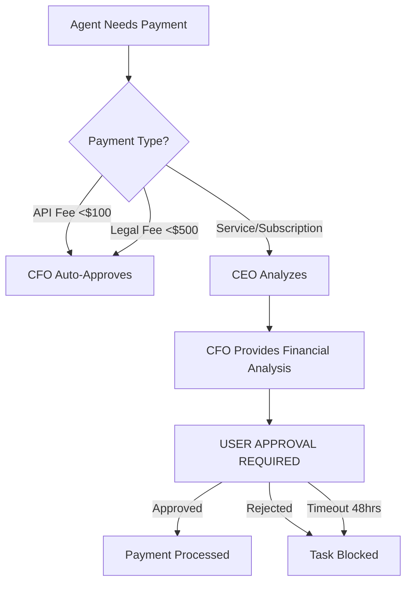

# 🎯 CEO/CFO Architecture Upgrade - Complete Summary

## Executive Summary

Your multi-agent system has been upgraded from CFO-led to **CEO-led with financial oversight**. This upgrade adds executive decision-making, enhanced financial safety, and mandatory user approval for all spending.

---

## 🔄 What Changed

### Before (CFO-Led System)
```
┌─────────────────┐
│   CFO Agent     │ ← Strategic planner + Financial manager
│  (Do Everything)│
└────────┬────────┘
         │
    ┌────┴───────────────────────────┐
    │                                │
┌───▼────┐  ┌──────┐  ┌──────┐  ┌──────┐
│Branding│  │ Web  │  │Legal │  │Others│
│ Agent  │  │ Dev  │  │Agent │  │      │
└────────┘  └──────┘  └──────┘  └──────┘
```

**Problems:**
- CFO had too much authority (strategy + finance)
- No separation of concerns
- Budget could be spent without approval
- No executive oversight
- Financial liability risks unchecked

### After (CEO-Led System)
```
┌──────────────────────────────────────┐
│         CEO Agent                     │
│  (Executive Decision Maker)           │
│  - Strategic planning                 │
│  - Agent orchestration                │
│  - Risk assessment                    │
│  - Approval workflow                  │
└────────────┬─────────────────────────┘
             │
      ┌──────┴───────┐
      │              │
┌─────▼──────┐  ┌───▼────────────────────────┐
│ CFO Agent  │  │  Specialized Agents         │
│ (Financial)│  │  ┌──────┐  ┌──────┐  ┌──────┐│
│ Oversight  │  │  │Brand │  │ Web  │  │Legal ││
│            │  │  └──────┘  └──────┘  └──────┘│
│ - API fees │  └─────────────────────────────┘
│ - Budget   │
│   tracking │       ┌──────────────┐
│ - Cost     │       │     USER     │
│   analysis │       │  (Approver)  │
└────────────┘       │              │
      │              │ - Payments  │
      │              │ - Services  │
      └──────────────┤ - Spending  │
                     └─────────────┘
```

**Benefits:**
✅ Clear executive authority (CEO)
✅ Financial oversight separated (CFO)
✅ User approval required for spending
✅ Liability protection built-in
✅ No unauthorized financial commitments

---

## 📋 New Agent Roles

### 1. CEO Agent (Chief Executive Officer)
**File:** `agents/ceo_agent.py`

**Authority:**
- ✅ Strategic decision-making
- ✅ Task decomposition and prioritization
- ✅ Multi-agent orchestration
- ✅ Risk assessment and mitigation
- ⚠️ **CANNOT** approve payments (requires user approval)

**Responsibilities:**
```python
# CEO can make these decisions autonomously:
- Break down business objectives into tasks
- Deploy specialized agents for execution
- Set project timelines and milestones
- Assess risks and opportunities
- Create execution strategies

# CEO CANNOT do without user approval:
- Approve any spending
- Order services
- Make payments
- Enter contracts
```

**Guard Rails:**
- All financial commitments require user approval
- Cannot hire external vendors
- Must work within defined scope
- Decisions logged for audit trail

### 2. CFO Agent (Chief Financial Officer)
**File:** `agents/new_cfo_agent.py`

**Authority:**
- ✅ Monitor API costs (OpenAI, SendGrid, etc.)
- ✅ Track legal filing fees
- ✅ Approve API fees <$100
- ✅ Approve government filing fees <$500
- ⚠️ **CANNOT** approve anything else

**Budget:**
```yaml
CFO Managed Budget: $470 (API + legal fees only)
  - OpenAI API: ~$45/month
  - SendGrid: Free tier
  - DALL-E images: ~$13/month
  - Legal filing fees: ~$50-500

Everything Else: Requires USER approval
  - Website development: $35,000 → USER
  - Marketing campaigns: $3,000 → USER
  - Software subscriptions: $X → USER
```

**Responsibilities:**
```python
# CFO can approve automatically:
- API service fees <$100/transaction
- Government filing fees <$500
- Tool subscriptions within budget

# CFO analyzes but cannot approve:
- Service orders
- Software subscriptions >$100
- Advertising spend
- Any contractor payments (FORBIDDEN)

# CFO reports:
- Daily API spending
- Budget status
- Financial risks
- Payment recommendations (user decides)
```

---

## 🛡️ Enhanced Guard Rails

### Financial Safety Controls

**File:** `agents/agent_guard_rails.py`

#### Payment Types & Approval Levels

| Payment Type | Approval Level | Max Auto-Approved | User Approval? |
|:------------|:--------------|:-----------------|:--------------|
| API Fee | AUTO (CFO) | $100 | No |
| Legal Filing | AUTO (CFO) | $500 | No |
| Software Subscription | USER REQUIRED | $0 | **YES** |
| Service Order | USER REQUIRED | $0 | **YES** |
| Advertising Spend | USER REQUIRED | $0 | **YES** |
| Hardware Purchase | USER REQUIRED | $0 | **YES** |
| Contractor Payment | **FORBIDDEN** | $0 | N/A |

#### Liability Protection

```python
# New guard rails prevent:
1. Unauthorized spending
2. Contract commitments without approval
3. Hiring external vendors (FORBIDDEN)
4. Exceeding budget limits
5. Financial losses from agent errors

# Warnings trigger for:
- Contracts (legal obligations)
- Agreements (binding effects)
- Subscriptions (recurring costs)
- High filing fees (verification needed)
```

---

## 🔐 Approval Workflow

### How Payments Work Now



### Example Approval Flow

**Scenario:** Website Development ($35,000)

1. **CEO Agent** identifies need:
   ```
   Task: Build website with AR visualization
   Budget: $35,000
   Risk: HIGH
   Rationale: Digital presence essential for customer acquisition
   ```

2. **CEO** creates approval request:
   ```json
   {
     "approval_id": "PAY_T003",
     "task": "Website Development",
     "amount": 35000,
     "payment_type": "service_subscription",
     "requires_approval": true,
     "status": "pending_user_approval"
   }
   ```

3. **CFO** analyzes:
   ```
   CFO Analysis: High-value transaction
   Financial Impact: 70% of total budget
   Risk Assessment: HIGH
   Recommendation: REVIEW CAREFULLY - Requires detailed ROI analysis

   ⚠️  NOTE: Final approval required from user
   ```

4. **USER** decides:
   - Option A: **Approve** → Payment processed, task proceeds
   - Option B: **Reject** → Task blocked, budget preserved
   - Option C: **Timeout** → Auto-rejected after 48 hours

---

## 💰 Budget Allocation

### New Budget Structure

```yaml
Total Budget: $50,000

CFO Managed (Auto-Approved):
  API Services: $470
    - OpenAI API: $150/month
    - DALL-E: $80/month
    - SendGrid: Free
    - Design tools: $150/month
    - Analytics: $90/month

  Legal Fees: $500
    - DBA registration: $50
    - Trademark search: $400
    - Business licenses: $50

User Approval Required:
  Website Development: $35,000
  Marketing Campaigns: $3,000
  Additional Software: $11,030

Total Pending Approval: $49,030 (98% of budget)
```

### Why This Matters

**Before:** Agents could spend entire budget autonomously
**After:** Agents can only use $970 (2%) without your approval

This protects you from:
- Unauthorized spending
- Agent errors
- Service commitments you don't want
- Financial losses
- Liability exposure

---

## 🚀 How to Use the New System

### Quick Start

1. **Start the Flask app:**
   ```bash
   python3 app.py
   ```

2. **Click "Analyze Only":**
   - CEO analyzes objectives
   - Creates task list
   - Identifies payment requirements
   - Shows what needs approval

3. **Review Pending Approvals:**
   - CEO report shows all pending payments
   - CFO provides financial analysis
   - You decide what to approve

4. **Approve/Reject Payments:**
   ```
   GET /api/approvals/pending
   POST /api/approval/<approval_id>/approve
   POST /api/approval/<approval_id>/reject
   ```

5. **Agents Execute:**
   - Only approved tasks proceed
   - CFO monitors spending
   - CEO reports progress

### Example Session

```bash
# User clicks "Analyze Only"
CEO: Analyzing strategic objectives...
CEO: 6 tasks identified
CEO: 3 tasks require payment approval
CEO: Total pending approval: $38,500

# User reviews CEO report
Task T001: Legal Foundation - $500 (Auto-approved by CFO)
Task T002: Brand Identity - $120 (Auto-approved by CFO)
Task T003: Website - $35,000 (⚠️  REQUIRES YOUR APPROVAL)
Task T004: MarTech - $200 (Auto-approved by CFO)
Task T005: Content - $150 (Auto-approved by CFO)
Task T006: Campaigns - $3,000 (⚠️  REQUIRES YOUR APPROVAL)

# User approves T003 only
POST /api/approval/PAY_T003/approve
→ Website development proceeds

# User rejects T006
POST /api/approval/PAY_T006/reject
→ Campaign task blocked

# CEO executes approved tasks
CEO: Deploying agents for approved tasks...
CEO: 4 tasks proceeding (2 major tasks awaiting approval)
```

---

## 📊 API Changes

### New Endpoints

```python
# Get all pending approvals
GET /api/approvals/pending
Response: {
    "pending_count": 2,
    "total_value": 38000,
    "approvals": [...]
}

# Approve a payment
POST /api/approval/<approval_id>/approve
Response: {
    "success": true,
    "approval_id": "PAY_T003",
    "status": "approved_by_user"
}

# Reject a payment
POST /api/approval/<approval_id>/reject
Body: {"reason": "Budget insufficient"}
Response: {
    "success": true,
    "approval_id": "PAY_T003",
    "status": "rejected_by_user"
}

# Get CFO financial report
GET /api/cfo/report
Response: {
    "api_spend": 58.00,
    "legal_fees": 50.00,
    "pending_approvals": 38000,
    "budget_alerts": [...]
}

# CEO strategic analysis (replaces old CFO analyze)
POST /api/ceo/analyze
Body: {
    "company_name": "...",
    "industry": "...",
    "budget": 50000,
    "objectives": [...]
}
Response: {
    "tasks": [...],
    "pending_approvals": [...],
    "executive_decisions": [...]
}
```

---

## ⚠️ Breaking Changes

### Route Updates

```python
# OLD (Deprecated)
POST /api/cfo/analyze → Now: POST /api/ceo/analyze
GET /api/cfo/status → Now: GET /api/ceo/status

# NEW (Required)
GET /api/approvals/pending → Get pending payment approvals
POST /api/approval/<id>/approve → Approve payment
POST /api/approval/<id>/reject → Reject payment
GET /api/cfo/report → CFO financial oversight report
```

### Model Changes

```python
# OLD
from models import CFOState → Now: CEOState

# NEW
from agents.ceo_agent import CEOAgentState
from agents.new_cfo_agent import CFOAgentState
```

---

## 🧪 Testing the Upgrade

### Test CEO Agent

```bash
python3 agents/ceo_agent.py
```

**Expected Output:**
```
👔 CEO AGENT - EXECUTIVE STRATEGIC ANALYSIS
...
Tasks Identified: 6
Pending User Approvals: 2
CFO Budget (API/Tools): $970.00
Requires User Approval: $38,500.00
```

### Test CFO Agent

```bash
python3 agents/new_cfo_agent.py
```

**Expected Output:**
```
💰 CFO - FINANCIAL OVERSIGHT REPORT
...
API Services: $58.00
Legal Filing Fees: $50.00
Payment Requests Awaiting User Approval: 2
Total Value Pending: $38,500.00
```

### Test Guard Rails

```bash
python3 -c "
from agents.agent_guard_rails import AgentGuardRail, PaymentType, AgentDomain

guard = AgentGuardRail(AgentDomain.BRANDING)

# Test payment validation
result = guard.validate_payment_request(
    payment_type=PaymentType.SERVICE_ORDER,
    amount=35000,
    description='Website development'
)

print('Approved:', result['approved'])
print('Requires User Approval:', result['requires_user_approval'])
print('Risk Level:', result['risk_level'])
"
```

**Expected:**
```
Approved: False
Requires User Approval: True
Risk Level: HIGH
```

---

## 📋 Migration Checklist

### For Existing Projects

- [ ] Update all `cfo_agent` imports to `ceo_agent`
- [ ] Add approval workflow to frontend
- [ ] Test payment approval endpoints
- [ ] Review guard rail configurations
- [ ] Update documentation references
- [ ] Train team on new approval process

### New Features to Implement

- [ ] Frontend "Pending Approvals" UI
- [ ] Email notifications for approval requests
- [ ] Approval timeout handling
- [ ] CFO financial dashboard
- [ ] Audit trail viewer
- [ ] Budget alert system

---

## 🎓 Best Practices

### 1. Review All Payments
Never auto-approve high-value payments. Review:
- Amount vs. expected value
- Service necessity
- Alternative options
- ROI projections

### 2. Monitor CFO Reports
Check weekly:
- API spending trends
- Budget burn rate
- Upcoming expirations
- Alert notifications

### 3. Set Approval Timeouts
Configure timeout periods:
- Urgent: 24 hours
- Standard: 48-72 hours
- Auto-reject on timeout

### 4. Audit Regularly
Review quarterly:
- All approved payments
- Rejected requests
- Agent decisions
- Budget variances

---

## 🔒 Security Benefits

### Protection Against

✅ **Unauthorized Spending**
- All payments >$100 require approval
- No autonomous financial commitments

✅ **Agent Errors**
- CEO decisions reviewed before execution
- CFO provides financial analysis
- User has final say

✅ **Liability Exposure**
- No contractor payments allowed
- Contract warnings enforced
- Legal obligations flagged

✅ **Budget Overruns**
- Hard limits on auto-approved amounts
- Real-time budget tracking
- Alert system for overspending

✅ **Service Lock-in**
- Subscription warnings
- Recurring cost analysis
- Easy rejection of unwanted commitments

---

## 📈 What's Next

### Recommended Enhancements

1. **Approval UI** - Build frontend for payment approvals
2. **Notifications** - Email/SMS for approval requests
3. **Analytics** - Dashboard showing spending patterns
4. **Forecasting** - CFO predicts future costs
5. **Integrations** - Connect to accounting software

### Future Roadmap

- **Q1 2026:** Multi-currency support
- **Q2 2026:** ML-based risk prediction
- **Q3 2026:** Automated ROI tracking
- **Q4 2026:** Integration with payment processors

---

## 🆘 Troubleshooting

### "Payment not auto-approved"
**Cause:** Amount exceeds CFO limit or requires user approval
**Fix:** Approve via `/api/approval/<id>/approve` or adjust limits

### "Task blocked - pending approval"
**Cause:** Task requires payment that hasn't been approved
**Fix:** User must approve payment for task to proceed

### "Guard rail violation"
**Cause:** Agent attempted forbidden action
**Fix:** Review guard rails, ensure agents stay in scope

### "CFO cannot approve this"
**Cause:** Payment type outside CFO authority
**Fix:** User approval required - this is intentional protection

---

## 📞 Support

### Documentation
- CEO Agent: `agents/ceo_agent.py`
- CFO Agent: `agents/new_cfo_agent.py`
- Guard Rails: `agents/agent_guard_rails.py`
- Roadmap: `REAL_WORLD_EXECUTION_ROADMAP.md`

### Testing
- Run included test scripts in each agent file
- Check TEST_RESULTS.md for system validation

### Questions
Review the architecture diagrams and code comments for detailed implementation notes.

---

## ✅ Summary

Your system now has:
1. ✅ **CEO Agent** - Executive leadership and decision-making
2. ✅ **CFO Agent** - Financial oversight and monitoring
3. ✅ **User Approval** - Required for all significant spending
4. ✅ **Guard Rails** - Comprehensive financial safety
5. ✅ **Audit Trail** - Complete transparency
6. ✅ **Risk Protection** - Liability and loss prevention

**Bottom Line:** You now have corporate-grade governance for your AI agents with full financial control and zero unauthorized spending risk! 🎉
